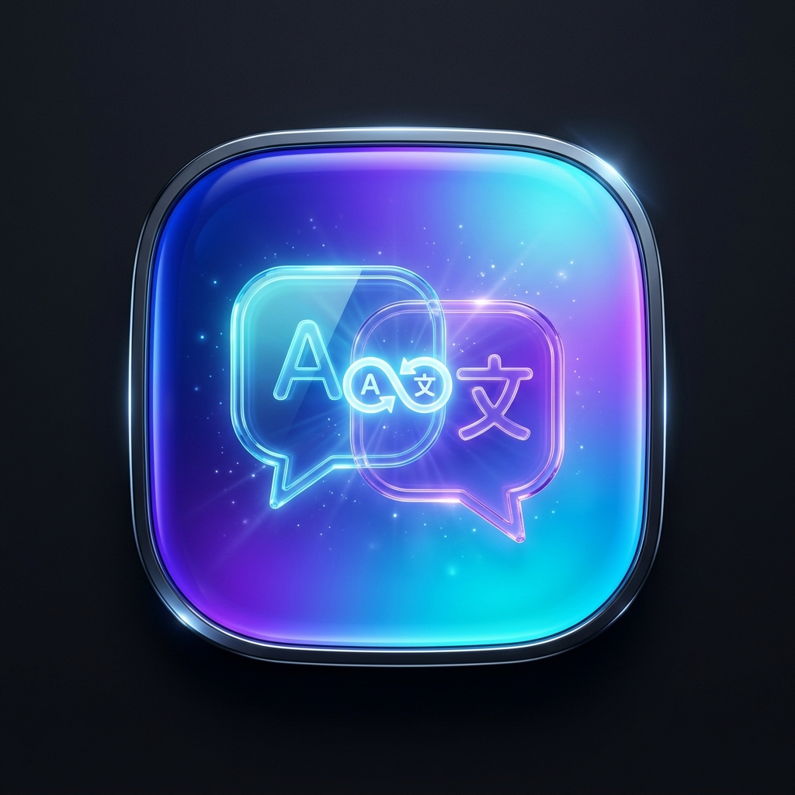

<div align="center">



# Typist Translator

**แปลภาษาขณะพิมพ์ ในทุกโปรแกรมบน Windows โดยไม่ต้องสลับหน้าต่าง**

พิมพ์ข้อความในโปรแกรมไหนก็ได้ → กดคีย์ลัดหนึ่งครั้ง → คำแปลถูกวางทับลงไปในที่เดิม

[](LICENSE)


สร้างโดย **Mrgunshi** ([@luraselenehalo](https://github.com/luraselenehalo))

</div>

---

## 📌 โปรแกรมนี้คืออะไร

เวลาคุยกับคนต่างชาติใน Discord, LINE, Messenger, Slack หรือเขียนอีเมลในเบราว์เซอร์
ปกติต้องเปิดแท็บ Google Translate → คัดลอกไป → คัดลอกกลับ → วาง ทุกครั้งที่จะส่งข้อความ

โปรแกรมนี้ตัดขั้นตอนนั้นออกทั้งหมด **พิมพ์ในช่องเดิม กดคีย์ลัด แล้วข้อความก็เปลี่ยนเป็นคำแปล**
ไม่ต้องละมือจากคีย์บอร์ด ไม่ต้องสลับหน้าต่าง ทำงานได้กับทุกโปรแกรมที่มีช่องพิมพ์ข้อความ

```
พิมพ์:  สวัสดีครับ ยินดีที่ได้ร่วมงานกันครับ
กด:     Ctrl + Alt + T
ได้:    Hello, nice to work with you.
```

---

## ✨ คุณสมบัติ

| | |
|---|---|
| ⌨️ **แปลและแทนที่ในที่เดิม** | ไม่ต้องคัดลอก ไม่ต้องเปิดแท็บใหม่ ข้อความในช่องเดิมเปลี่ยนเป็นคำแปลทันที |
| 🔄 **สลับภาษาอัตโนมัติ** | พิมพ์ไทยได้อังกฤษ พิมพ์อังกฤษได้ไทย หรือเลือกคู่ภาษาเองจาก 100+ ภาษา |
| ⏳ **เห็นตลอดว่ากำลังแปลอยู่** | ป้ายลอยเหนือทุกหน้าต่าง ขึ้นตรงข้อความที่กำลังแปล พร้อมตัวนับวินาทีเมื่อเอนจินช้า |
| 🎯 **โหมดเลือกข้อความ 4 แบบ** | ทั้งหมด (Ctrl+A), อัจฉริยะ, จากต้นบรรทัด (Shift+Home), เฉพาะที่คลุมดำ |
| 🤖 **5 เอนจินแปลภาษา** | Google Translate, MyMemory (ฟรี) และ DeepL, Gemini, OpenAI/Groq/Local LLM |
| 🌍 **หน้าตาโปรแกรม 4 ภาษา** | ไทย / English / 日本語 / 简体中文 สลับได้ทันทีไม่ต้องเปิดใหม่ |
| ⚡ **จำคำแปลเดิมไว้** | แปลซ้ำคำเดิมได้คำตอบทันที (0.02 ms) ไม่ต้องยิงเน็ตซ้ำ |
| 🔒 **ข้อมูลอยู่ในเครื่อง** | ประวัติและ API Key อยู่ใน `config.json` ของคุณเท่านั้น ไม่มีการเก็บสถิติการใช้งาน |
| 🖥️ **ทำงานเบื้องหลัง** | ปิดหน้าต่างแล้วย่อลง System Tray คีย์ลัดยังทำงานต่อ |

---

## 🚀 เริ่มใช้งาน

### สิ่งที่ต้องมี

- **Windows 10 / 11**
- **Python 3.10 ขึ้นไป** — [ดาวน์โหลด](https://www.python.org/downloads/) (ตอนติดตั้งอย่าลืมติ๊ก *Add Python to PATH*)
- **Node.js** — [ดาวน์โหลด](https://nodejs.org/) *(ใช้ครั้งแรกครั้งเดียวเพื่อสร้างหน้าตาโปรแกรม)*
- **WebView2 Runtime** — Windows 11 มีมาให้อยู่แล้ว, Windows 10 บางเครื่องอาจต้อง [ติดตั้งเพิ่ม](https://developer.microsoft.com/microsoft-edge/webview2/)

### ติดตั้ง

```bash
git clone https://github.com/luraselenehalo/typist-translator.git
cd typist-translator
pip install -r requirements.txt
cd ui && npm install && npm run build && cd ..
```

### เปิดใช้งาน

ดับเบิลคลิก **`run.bat`** (สร้าง UI ให้อัตโนมัติถ้ายังไม่เคยสร้าง) หรือ

```bash
python main.py
```

เปิดแบบไม่มีหน้าต่างคอนโซล: ดับเบิลคลิก **`run_silent.vbs`**
แก้หน้าตาแล้วสร้างใหม่: ดับเบิลคลิก **`build_ui.bat`**

---

## 🎯 วิธีใช้

1. เปิดโปรแกรม แล้วปล่อยให้ทำงานอยู่เบื้องหลัง (ย่อลง System Tray ได้)
2. ไปที่โปรแกรมไหนก็ได้ — Discord, LINE, Word, Chrome
3. พิมพ์ข้อความภาษาไทย
4. กด **`Ctrl + Alt + T`** (เปลี่ยนคีย์ลัดได้ในแท็บตั้งค่า)
5. ข้อความกลายเป็นคำแปลทันที

> **ทิปส์** — ถ้าใช้ในช่องแชท แนะนำโหมด *เลือกทั้งหมด (Ctrl+A)*
> ถ้าใช้ในเอกสารยาว แนะนำโหมด *จากต้นบรรทัด (Shift+Home)* จะได้ไม่แปลทั้งเอกสาร

---

## ⏳ แอนิเมชันตอนกำลังแปล

เพราะบางเอนจินตอบช้า และการกดคีย์ลัดแล้วไม่มีอะไรเกิดขึ้นเลยทำให้เหมือนโปรแกรมค้าง
เวลากดคีย์ลัด ป้ายเล็กๆ จะโผล่ขึ้นมา **ตรงข้อความที่กำลังแปล** และลอยเหนือทุกหน้าต่างจนกว่าจะเสร็จ

| สถานะ | สิ่งที่เห็น |
|---|---|
| กำลังอ่านข้อความ | วงหมุน + ชื่อเอนจินที่ใช้ |
| กำลังแปล | ข้อความต้นฉบับวิ่งไล่แสง + แถบความคืบหน้า + ตัวนับวินาที (โผล่หลัง 1.4 วิ) |
| เสร็จ / ล้มเหลว | ✓ เขียว หรือ ✕ แดงพร้อมสาเหตุ แล้วค่อยๆ จางหาย |

ถ้าเอนจินช้าเกิน 6 วินาที ข้อความจะเปลี่ยนเป็น "ยังแปลอยู่ รอสักครู่…" เพื่อบอกว่ายังทำงานอยู่

**หาตำแหน่งได้อย่างไร** — ไล่ตามลำดับความแม่นยำ:

1. ตำแหน่งเคอร์เซอร์จริง (`GetGUIThreadInfo`) — ใช้ได้กับ Notepad, Word, ช่องกรอกแบบ Win32
2. กรอบของช่องที่โฟกัสอยู่ ถ้าเป็นคอนโทรลย่อยจริงๆ
3. ถ้าเป็นหน้าต่าง Chromium/Electron ทั้งบาน (Discord, LINE, Slack, เบราว์เซอร์) Windows ไม่บอกตำแหน่งเคอร์เซอร์ — จึงวางกลางจอเหนือขอบล่าง ซึ่งเป็นที่ตั้งของช่องแชท

ป้ายนี้ **คลิกทะลุ** และ **ไม่แย่งโฟกัส** เด็ดขาด เพราะขั้นตอนหลังจากนั้นคือการส่ง
`Ctrl+A` / `Ctrl+C` / `Ctrl+V` ไปยังหน้าต่างที่โฟกัสอยู่ — ถ้าป้ายแย่งโฟกัสไป คีย์ลัดจะพังทันที
รายละเอียด Win32 ที่ต้องระวังอยู่ใน [`win_overlay.py`](win_overlay.py)

ปิดได้ที่ **แท็บตั้งค่า › หัวข้อที่ 4**

---

## 🏗️ สถาปัตยกรรม

หน้าตาโปรแกรมเป็น **React** เรนเดอร์ด้วย **WebView2** ที่ติดมากับ Windows อยู่แล้ว
ส่วนงานที่คุยกับ Windows ยังเป็น **Python** ทั้งหมด

```
  React (ui/dist/index.html)  ─── เรนเดอร์โดย WebView2
        │  window.pywebview.api      →  api_bridge.Api      (JS เรียก Python)
        │  window.__typistEvent      ←  Api.push_event      (Python ส่งอีเวนต์กลับ)
  Python backend
        hotkey_manager    คีย์ลัดทั่วระบบ + เลือก/คัดลอก/แปล/วาง
        overlay_window    ป้าย "กำลังแปล…" ลอยเหนือทุกหน้าต่าง
        toast_window      ป๊อปอัปแจ้งผลมุมขวาล่าง
        win_overlay       Win32 ที่หน้าต่างลอยทั้งสองใช้ร่วมกัน
        translator_core   5 เอนจิน + ตรวจภาษา + translation memory
        http_pool         การเชื่อมต่อแบบ keep-alive
        history_store     ประวัติการแปล (เขียนจากเธรดคีย์ลัดได้)
        tray_manager      ไอคอน System Tray
        i18n              คำแปลหน้าตาโปรแกรม (ใช้ร่วมกันทั้งสองฝั่ง)
        about             ชื่อผู้สร้าง ลิงก์ และเวอร์ชัน
```

**ทำไมถึงไม่ใช้ Tkinter** — เวอร์ชันก่อนใช้ CustomTkinter ซึ่งวาดทุก widget ลง canvas ด้วย Python
สร้าง widget หนึ่งตัวใช้เวลา **4–12 ms** ทั้งหน้าต่างมี ~573 ตัว เปิดโปรแกรมช้าและสลับแท็บหน่วง

| | CustomTkinter (V3) | WebView + React (V4) |
|---|---|---|
| เปิดโปรแกรมจนใช้งานได้ | 3,209 ms | **~1,000 ms** |
| สลับแท็บ (ครั้งแรก) | 419–880 ms | **< 1 ms** |
| สลับแท็บ (ครั้งต่อไป) | ~149 ms | **< 1 ms** |
| เปลี่ยนภาษาโปรแกรม | สร้าง UI ใหม่ทั้งหมด | เปลี่ยน state ของ React |
| Animation | เอนจินเขียนเอง 60 FPS | CSS transitions (GPU) |

UI ทั้งหมดถูก inline เป็นไฟล์ HTML ไฟล์เดียว ~200 KB ไม่ต้องมีเซิร์ฟเวอร์ ไม่ต้องแบก Chromium

---

## 📁 โครงสร้างไฟล์

| ไฟล์ | หน้าที่ |
|---|---|
| `main.py` | จุดเริ่มโปรแกรม เชื่อม WebView + คีย์ลัด + Tray |
| `about.py` | **ชื่อผู้สร้าง ลิงก์ และเวอร์ชัน — แก้ที่นี่ที่เดียว** |
| `api_bridge.py` | สัญญาระหว่าง Python กับ React (17 เมธอดที่ JS เรียกได้) |
| `hotkey_manager.py` | คีย์ลัดทั่วระบบ และขั้นตอนเลือก-คัดลอก-แปล-วาง |
| `translator_core.py` | เอนจินแปลทั้งหมด + ฐานข้อมูล 100+ ภาษา + cache |
| `overlay_window.py` | ป้าย "กำลังแปล…" ที่ลอยข้างข้อความ |
| `toast_window.py` | ป๊อปอัปลอยแจ้งผล |
| `win_overlay.py` | Win32 ของหน้าต่างลอย: ไม่แย่งโฟกัส, คลิกทะลุ, หาตำแหน่งเคอร์เซอร์ |
| `history_store.py` | ประวัติการแปล ปลอดภัยต่อการเขียนข้ามเธรด |
| `http_pool.py` | Connection pool แบบ keep-alive |
| `i18n.py` | คำแปลหน้าตาโปรแกรม 4 ภาษา (ส่งให้ React ตอน bootstrap) |
| `tray_manager.py` | ไอคอนใน System Tray |
| `config_manager.py` | อ่าน/เขียน `config.json` |
| `make_icon.py` | สร้าง `icon.ico` + ไอคอนโปร่งใสจาก `icon.png` |
| `ui/src/` | ซอร์ส React (แก้ที่นี่แล้วสั่ง `build_ui.bat`) |
| `ui/dist/` | UI ที่สร้างแล้ว (ไฟล์เดียวจบ ~200 KB) |

---

## ⚙️ การตั้งค่า

ค่าทั้งหมดอยู่ใน `config.json` ซึ่งสร้างอัตโนมัติเมื่อเปิดโปรแกรมครั้งแรก
แก้ผ่านหน้าโปรแกรมได้เลย ไม่ต้องแก้ไฟล์เอง

> ⚠️ `config.json` มี **API Key** ของคุณอยู่ — ไฟล์นี้อยู่ใน `.gitignore` แล้ว **อย่า commit ขึ้น GitHub**

| ค่า | ความหมาย | ค่าเริ่มต้น |
|---|---|---|
| `hotkey` | คีย์ลัดที่ใช้แปล | `ctrl+alt+t` |
| `selection_mode` | วิธีเลือกข้อความ: `all` / `smart` / `line` / `selection` | `all` |
| `swap_lang_a` / `swap_lang_b` | คู่ภาษาที่สลับกัน | `th` / `en` |
| `translation_engine` | เอนจินที่ใช้ | `google_gtx` |
| `show_progress_overlay` | แสดงป้าย "กำลังแปล…" | `true` |
| `show_toast_notification` | แสดงป๊อปอัปแจ้งผล | `true` |
| `app_language` | ภาษาของหน้าโปรแกรม | `th` |

---

## 🌍 ภาษาของโปรแกรม

เลือกที่ **แท็บตั้งค่า › หัวข้อที่ 1** เปลี่ยนได้ทันทีโดยไม่ต้องเปิดโปรแกรมใหม่

| ภาษา | โค้ด | ภาษา | โค้ด |
|---|---|---|---|
| 🇹🇭 ไทย | `th` (ค่าเริ่มต้น) | 🇯🇵 日本語 | `ja` |
| 🇬🇧 English | `en` | 🇨🇳 简体中文 | `zh-CN` |

ครอบคลุมหน้าต่างหลัก เมนู System Tray หน้าต่างเลือกภาษา ป้ายแปล และป๊อปอัป Toast

**เพิ่มภาษาใหม่:** แก้ [`i18n.py`](i18n.py) ไฟล์เดียว — เพิ่มรายการใน `UI_LANGUAGES` และ `CATALOG["<โค้ด>"]`
คีย์ที่ยังแปลไม่ครบจะถอยไปใช้อังกฤษแล้วไทยตามลำดับ โปรแกรมไม่พังและไม่โชว์ชื่อคีย์ดิบ

---

## 🎨 ไอคอนโปรแกรม

ไอคอนหน้าต่าง แถบ Taskbar และ System Tray ใช้ `icon.ico` / `icon_alpha.png` ซึ่งสร้างจาก `icon.png`:

```bash
python make_icon.py
```

สคริปต์จะตัดพื้นหลังสี่เหลี่ยมทึบออกให้เหลือเฉพาะตัวไอคอน (โปร่งใส) แล้วสร้าง `icon.ico`
ครบทุกขนาดที่ Windows ใช้ (16–256 px) เปลี่ยน `icon.png` แล้วสั่งใหม่ได้เลย
จากนั้นสั่ง `build_ui.bat` เพื่อให้ไอคอนบนหัวหน้าต่างอัปเดตด้วย

> โปรแกรมกำหนด **AppUserModelID** ของตัวเองไว้ ทำให้ Windows แสดงไอคอนนี้บน Taskbar
> และปักหมุดได้ แทนที่จะถูกจับรวมกับ Python

---

## 🧪 การทดสอบ

```bash
python test_app.py       # smoke test: config, เอนจินแปล, คีย์ลัด, API bridge
python test_backend.py   # backend เต็มรูปแบบ (headless) — สัญญา API, history, cache, i18n, overlay
python test_webview.py   # เปิดหน้าต่างจริงแล้วขับผ่าน DOM — 39 การตรวจสอบ
```

ทั้งสองชุดหลัง snapshot `config.json` ไว้ก่อนรันแล้วคืนค่าแบบ byte-for-byte พร้อม assert ยืนยัน
รันเทสต์แล้วการตั้งค่าของคุณไม่เปลี่ยน

---

## 🤝 ร่วมพัฒนา

ยินดีรับ Issue และ Pull Request ครับ

- เจอบั๊ก → เปิด Issue พร้อมบอกว่าใช้โปรแกรมอะไร เอนจินไหน และเกิดอะไรขึ้น
- อยากได้ฟีเจอร์ → เปิด Issue เล่าปัญหาที่เจอ ไม่ต้องเสนอทางแก้ก็ได้
- ส่งโค้ด → รัน `python test_backend.py` ให้ผ่านก่อนส่ง PR

**เพิ่มเอนจินแปลใหม่:** เพิ่มรายการใน `TRANSLATION_ENGINES` และเขียนฟังก์ชันแปลใน
[`translator_core.py`](translator_core.py) — ส่วนที่เหลือของโปรแกรมรู้จักมันเองโดยอัตโนมัติ

---

## 👤 ผู้พัฒนา

<div align="center">

**Mrgunshi**

[](https://github.com/luraselenehalo)

</div>

> **Mrgunshi** และ **luraselenehalo** คือคนเดียวกัน — บัญชี GitHub ที่ดูแลโปรเจกต์นี้คือ
> [luraselenehalo](https://github.com/luraselenehalo)

ช่องทางติดตามเพิ่มเติม (Facebook, อีเมล) ยังไม่ได้ตั้งค่า — เพิ่มได้ที่
[`about.py`](about.py) แล้วเปิดโปรแกรมใหม่ แท็บ "เกี่ยวกับ" จะแสดงให้เอง ไม่ต้องสร้าง UI ใหม่

---

## 📄 สัญญาอนุญาต

เผยแพร่ภายใต้สัญญาอนุญาต [MIT](LICENSE) — ใช้ แก้ไข และแจกจ่ายต่อได้
ทั้งงานส่วนตัวและงานเชิงพาณิชย์ ขอเพียงคงเครดิตของผู้สร้างไว้

© 2026 Mrgunshi

---

<details>
<summary><b>English summary</b></summary>

<br>

### Typist Translator

Translate as you type, in any Windows application, without leaving it.

Type in any app — a chat box, a document, a browser — and press one hotkey.
It selects your text, sends it to a translation engine, and pastes the result
back over it. No copying, no extra tab, no taking your hands off the keyboard.

**Features**

- In-place translation triggered by a global hotkey
- Auto-swap between two languages, chosen from 100+
- A progress chip pinned above every window while the engine works, anchored
  at the caret, click-through and focus-safe
- Five engines: Google Translate, MyMemory (free), DeepL, Gemini, OpenAI/Groq/Local LLM
- Interface in Thai, English, Japanese and Simplified Chinese
- In-memory translation cache, keep-alive HTTP pooling, system tray operation
- No telemetry. History and API keys stay in your local `config.json`

**Stack** — a Python backend (global hotkey, clipboard, tray) with a React
interface rendered by the WebView2 runtime that already ships with Windows.
The whole UI is one inlined ~200 KB HTML file: no server, no bundled Chromium.

**Install**

```bash
git clone https://github.com/luraselenehalo/typist-translator.git
cd typist-translator
pip install -r requirements.txt
cd ui && npm install && npm run build && cd ..
python main.py
```

Requires Windows 10/11, Python 3.10+, Node.js (first build only) and the
WebView2 runtime (preinstalled on Windows 11).

Made by **Mrgunshi** — [@luraselenehalo](https://github.com/luraselenehalo) on GitHub
(same person, different handle). Released under the [MIT](LICENSE) license.

</details>
