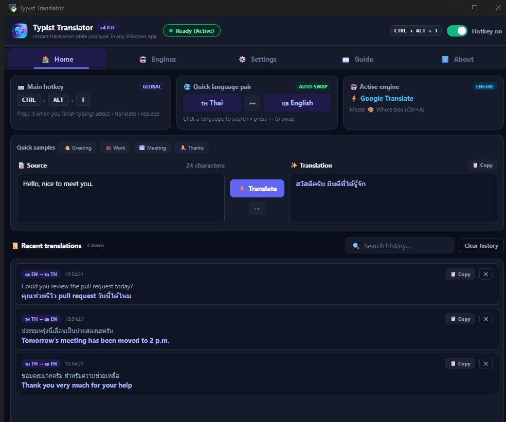
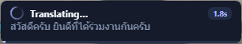
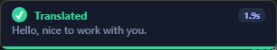
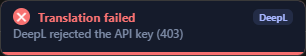
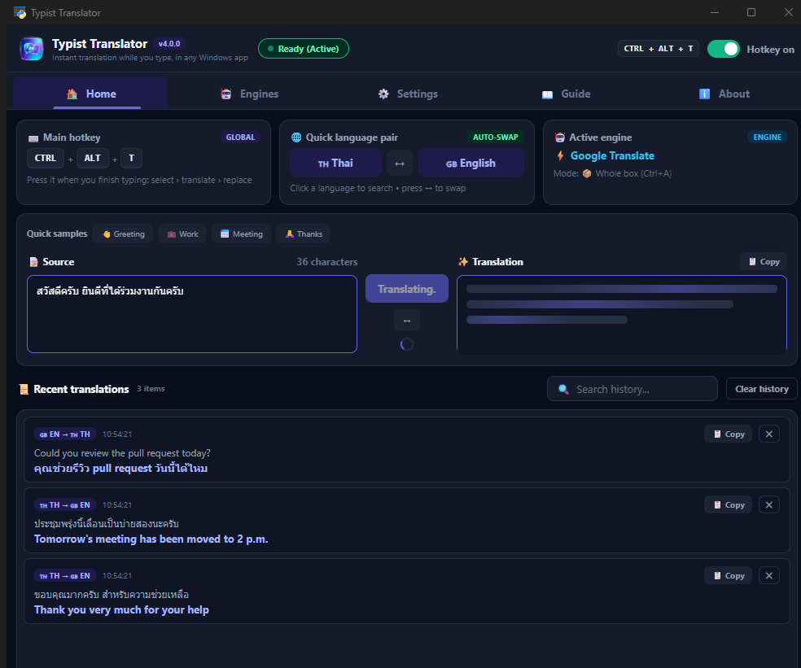
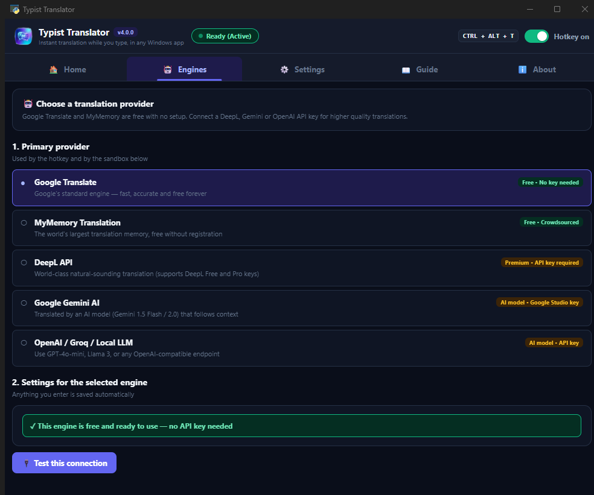
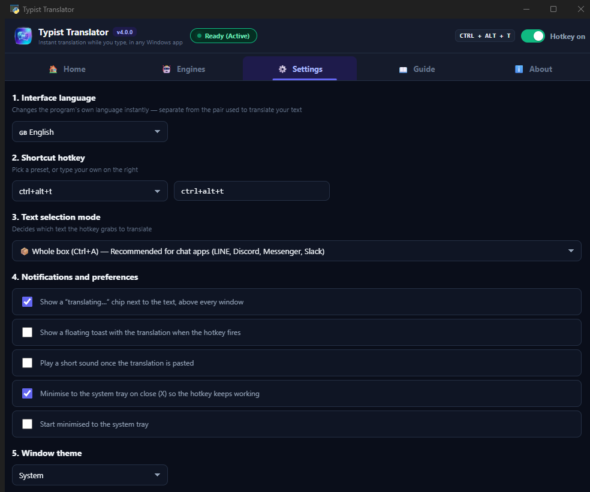
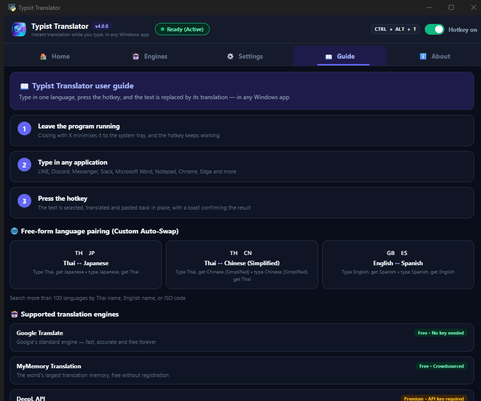
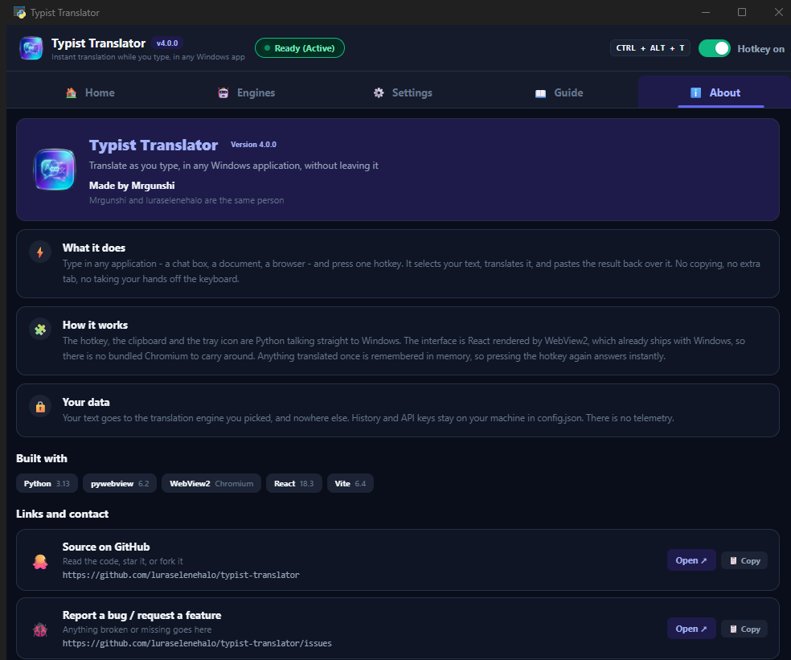
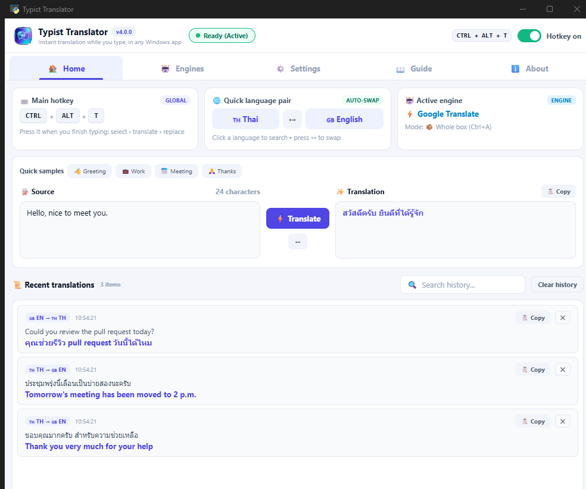

<div align="center">


# Typist Translator

**Translate as you type, in any Windows application, without leaving it.**

Type in any app → press one hotkey → your text is replaced by its translation.

[](LICENSE)


[](https://github.com/luraselenehalo/typist-translator/releases/latest)

Made by **Mrgunshi** ([@luraselenehalo](https://github.com/luraselenehalo))



</div>

---

## What it does

Talking to someone in another language in Discord, LINE, Messenger or Slack
normally means a second browser tab: copy out, paste in, copy back, paste
again — every single message.

This removes all of that. **Type in the box you are already in, press the
hotkey, and the text becomes the translation.** Your hands never leave the
keyboard and no window ever changes.

```
you type:   สวัสดีครับ ยินดีที่ได้ร่วมงานกันครับ
you press:  Ctrl + Alt + T
you get:    Hello, nice to work with you.
```

It works anywhere there is a text field — chat apps, documents, browsers,
terminals, game launchers.

---

## You can see it working

Some engines take a second or three. A hotkey that does nothing visible for
that long feels broken, so a small chip appears **right next to the text being
translated, floating above every window**, for exactly as long as the work
takes.

| | |
|---|---|
|  | Spinner, the source text shimmering as it is processed, an indeterminate progress bar, and an elapsed counter once the wait passes 1.4 s |
|  | Green tick, the finished translation, and how long it took — then it fades out |
|  | What actually went wrong. Failures used to happen in complete silence |

If an engine takes longer than six seconds the label changes to *"Still
translating, hang on…"* so you know it is alive rather than stuck.

**How it finds the text**, in order of how much it actually knows:

1. The real caret position (`GetGUIThreadInfo`) — exact, and works in Notepad,
   Word and any native Win32 field.
2. The focused child control, when it is a real sub-window.
3. Otherwise the window is one big Chromium/Electron surface (Discord, LINE,
   Slack, a browser) and Windows will not report a caret — so the chip is
   centred above the bottom edge, where chat apps put the box you type in.

The chip is **click-through** and **never takes focus**. That is not cosmetic:
the very next thing the workflow does is send `Ctrl+A` / `Ctrl+C` / `Ctrl+V` to
whatever is focused, so a chip that stole focus would break the whole feature.
The Windows details are documented in [`win_overlay.py`](win_overlay.py).

Turn it off in **Settings → section 4** if you prefer.

---

## Features

| | |
|---|---|
| ⌨️ **In-place translation** | One hotkey selects, translates and pastes back over your text |
| 🔄 **Automatic language swap** | Thai in → English out, English in → Thai out, or any pair from 100+ languages |
| ⏳ **Live progress overlay** | Pinned above every window, anchored at the caret, with an elapsed counter |
| 🎯 **Four selection modes** | Whole box (Ctrl+A), Smart, From line start (Shift+Home), Selection only |
| 🤖 **Five engines** | Google Translate, MyMemory (free, no setup), DeepL, Gemini, OpenAI/Groq/Local LLM |
| 🌍 **Interface in four languages** | English, ไทย, 日本語, 简体中文 — switches instantly, no restart |
| ⚡ **Translation memory** | Repeating a phrase answers in 0.02 ms instead of hitting the network |
| 🔒 **Everything stays local** | History and API keys live in your own `config.json`. No telemetry |
| 🖥️ **Runs from the tray** | Close the window and the hotkey keeps working |

---

## Screenshots

<table>
<tr>
<td width="50%"><br><sub><b>Home</b> — hotkey, language pair, engine, a sandbox to try phrases, and history</sub></td>
<td width="50%"><br><sub><b>While translating</b> — the source sweeps and the result pane shimmers, so a stale translation is never mistaken for a fresh one</sub></td>
</tr>
<tr>
<td><br><sub><b>Engines</b> — pick one, paste an API key, test the connection</sub></td>
<td><br><sub><b>Settings</b> — interface language, hotkey, selection mode, notifications, theme</sub></td>
</tr>
<tr>
<td><br><sub><b>Guide</b> — how it works and what each engine is good for</sub></td>
<td><br><sub><b>About</b> — what it does, the stack, links and licence</sub></td>
</tr>
</table>

Light theme is a click away:

<div align="center">

</div>

---

## Getting started

### Requirements

- **Windows 10 or 11**
- **[Python 3.10+](https://www.python.org/downloads/)** — tick *Add Python to PATH* during setup
- **WebView2 runtime** — ships with Windows 11; Windows 10 may need it
  [from Microsoft](https://developer.microsoft.com/microsoft-edge/webview2/)
- **[Node.js](https://nodejs.org/)** — only if you build the interface yourself

### Option 1 — the installer *(nothing else needed)*

Download **`TypistTranslator-Setup-<version>.exe`** from
**[Releases](https://github.com/luraselenehalo/typist-translator/releases/latest)**
and run it. No Python, no Node.js, no command line.

> The only address these builds are published from is
> **github.com/luraselenehalo/typist-translator**. A copy of this app offered
> anywhere else did not come from me.

It installs for your user only, so Windows never asks for administrator rights.
The wizard opens by asking which of the four interface languages you want, and
its last page offers a Desktop shortcut and start-with-Windows.

Once installed the app keeps itself up to date — see below.

#### Windows will warn you the first time

You will see a blue **"Windows protected your PC"** box saying
*Publisher: Unknown publisher*. Click **More info**, then **Run anyway**.

That is expected, and it is not a judgement about the file. Windows shows it
for every application that has not been signed with a paid code-signing
certificate, and this one has not been. It will keep appearing on each new
version until that changes — see
**[Security and signing](docs/SECURITY.md)** for what it would take and where
that currently stands.

What you can check instead, before running anything:

- **Compare the checksum.** Every release lists the SHA-256 of both files in
  its notes. In PowerShell:
  `Get-FileHash .\TypistTranslator-Setup-<version>.exe`
- **Read the scan.** Each release links a VirusTotal report for both files.
- **Build it yourself.** `python build.py` produces exactly the published
  files, from the source in this repository.

#### Or install without the warning

Both of these skip the dialog entirely, and neither needs anything installed
first beyond the package manager itself:

```powershell
winget install Mrgunshi.TypistTranslator
```

```powershell
scoop bucket add typist https://github.com/luraselenehalo/scoop-bucket
scoop install typist-translator
```

#### The portable build

`TypistTranslator-<version>-portable.zip` is the same build in a folder you can
unpack anywhere. It cannot update itself, and its README says so. Note that
Windows carries the same warning across to files extracted from a downloaded
zip, so this is not a way around the dialog.

### Option 2 — from source

```bash
git clone https://github.com/luraselenehalo/typist-translator.git
cd typist-translator
pip install -r requirements.txt
cd ui && npm install && npm run build && cd ..
python main.py
```

`run.bat` builds the UI on first run if it is missing.
`run_silent.vbs` starts without a console window.
`build_ui.bat` rebuilds the interface after you change anything under `ui/src`.

### Building the installer yourself

```bash
pip install pyinstaller
python tools/get_innosetup.py    # fetches the compiler into tools/, portably
python build.py                  # -> release/TypistTranslator-Setup-<version>.exe
```

`build.py` reads the version from [`about.py`](about.py) and feeds it to the
executable's version resource, the installer and the filenames, so the number
lives in exactly one place.

---

## Using it

1. Start the app and leave it running — closing the window sends it to the tray
2. Go to any application: Discord, LINE, Word, Chrome
3. Type your message
4. Press **`Ctrl + Alt + T`** (changeable in Settings)
5. The text becomes its translation

> **Tip** — use *Whole box (Ctrl+A)* in chat apps, and *From line start
> (Shift+Home)* in long documents so you do not translate the entire file.

---

## Using it in games

Until 3.2.0 this did not work in games at all, and the reason turned out to be
one number. The app sent keystrokes with a **scan code of zero**. Ordinary
windows — Discord, Word, a browser — read the *virtual key* and were perfectly
happy, so nothing looked wrong. Games read the *scan code*, through DirectInput
or Raw Input, saw zero, and discarded every keystroke the app had ever sent
them. That is fixed: keys now carry their real scan code, extended keys are
flagged properly, and they are held long enough for a game running at 30 fps to
notice them.

If a game's chat box still shows nothing, it is almost certainly because the box
never implemented Ctrl+V. Go to **Settings → section 6** and choose
**Type the characters**. It is slower, but it sends the text itself rather than
asking the box to paste, which is what game text fields understand.

### When it still will not work

Run the diagnostic and it will tell you which part is failing:

```bash
python test_game_input.py
```

Click into the game's chat box during the countdown. It reports whether the
keystrokes arrive at all, whether the box supports Ctrl+A/Ctrl+C so the app can
*read* what you typed, and whether it supports Ctrl+V. Please include that table
when reporting a game that does not work.

Two limits worth knowing about, neither of which this app can fix:

- **If the box cannot be read**, translating text you already typed there is
  impossible — the app has nothing to send to the translator. Nothing in user
  mode changes that.
- **If the game runs as administrator and this app does not**, Windows blocks
  the keystrokes outright. The app now says so instead of failing silently.

### Roblox

Worth setting expectations honestly, because Roblox is the most common request
and it is the worst case:

- **Roblox already translates chat automatically**, in both directions,
  including Thai. For chat, you very likely do not need this app at all.
- **Roblox counts message length in bytes, not characters.** Thai is three
  bytes per character in UTF-8, so a Thai message is rejected at roughly a
  third of its visible length. That is Roblox's own limit and applies whether
  you type or paste.
- **Incoming chat cannot be selected or copied**, so translating what somebody
  else said is not possible from outside the game.

This app never injects code into another process, never reads or writes another
process's memory, and uses no driver — it only asks Windows to deliver
keystrokes, the same call every accessibility tool and text expander uses. That
is a deliberate design limit and not a claim about any particular game's rules:
if a game you play forbids external input tools, this app is an external input
tool, and that is your call to make.

---

## Updating itself

A card slides into the bottom-right corner when a new version exists. Accept it
and the app downloads the update, installs it, closes and reopens itself, then
shows what changed. Decline it, or skip that version, and it leaves you alone.
Turn it off in **Settings → section 4**, or press **Check for updates** there.

It only ever contacts this repository, and that address is compiled in rather
than read from your settings — a file anyone who could already write to your
profile could edit. Redirects are followed only to github.com and
githubusercontent.com over https, because GitHub serves downloads from one and
they cannot simply be refused. Every downloaded byte is hashed while streaming
and the file is only kept if it matches the SHA-256 GitHub publishes for it.

**The limit, stated plainly:** that checksum arrives in the same response as the
download link, so it proves the file was not altered in transit — not that it
was published by the author. Anyone who could push a release could publish a
payload and a matching hash. Closing that needs a code-signing certificate and a
signature check against a pinned publisher; until one exists this is the ceiling,
and [`updater.py`](updater.py) says so in its own docstring.

---

## Configuration

Everything is editable in the app; `config.json` is written for you on first
run.

Installed, it lives in `%APPDATA%\TypistTranslator\config.json` — deliberately
not beside the program, because an update replaces that whole folder. Run from
source, it stays in the project directory. Upgrading from a pre-3.1.0 copy, the
app finds the old file and brings it across.

> ⚠️ `config.json` holds your **API keys**. It is in `.gitignore` — never
> commit it.

| Key | Meaning | Default |
|---|---|---|
| `hotkey` | The global hotkey | `ctrl+alt+t` |
| `selection_mode` | `all` / `smart` / `line` / `selection` | `all` |
| `swap_lang_a` / `swap_lang_b` | The two languages to swap between | `th` / `en` |
| `translation_engine` | Which engine to use | `google_gtx` |
| `show_progress_overlay` | The floating "translating…" chip | `true` |
| `show_toast_notification` | The result toast in the corner | `true` |
| `check_for_updates` | Look for new releases and say so | `true` |
| `app_language` | Interface language | `th` |

---

## Architecture

The interface is **React** rendered by the **WebView2** runtime that already
ships with Windows. Everything that talks to Windows stays in **Python**.

```
  React (ui/dist/index.html)  ─── rendered by WebView2
        │  window.pywebview.api      →  api_bridge.Api    (JS calls Python)
        │  window.__typistEvent      ←  Api.push_event    (Python pushes back)
  Python backend
        hotkey_manager    global hotkey, then select / copy / translate / paste
        overlay_window    the "translating…" chip above every window
        toast_window      the result notification in the corner
        win_overlay       the Win32 both floating windows share
        translator_core   five engines, language detection, translation memory
        http_pool         keep-alive connections
        history_store     translation history, written from the hotkey thread
        tray_manager      system tray icon and menu
        i18n              interface catalogs, shared with the front end
        about             author, links and version
```

**Why not Tkinter.** The previous build used CustomTkinter, which draws every
widget onto a canvas from Python. One widget costs **4–12 ms** and the window
has ~573 of them, so it was slow to open and laggy to navigate.

| | Previous build (CustomTkinter) | This build (React + WebView2) |
|---|---|---|
| Startup to interactive | 3,209 ms | **~1,000 ms** |
| First tab switch | 419–880 ms | **< 1 ms** |
| Later tab switches | ~149 ms | **< 1 ms** |
| Changing interface language | rebuild the whole UI | a React state change |
| Animation | a hand-written 60 FPS engine | CSS transitions on the GPU |

The whole interface is inlined into a single ~200 KB HTML file. No server, no
bundled Chromium.

---

## Project layout

| File | Purpose |
|---|---|
| `main.py` | Entry point — wires the WebView, hotkey and tray together |
| `about.py` | **Author, links and version — the one file to edit** |
| `build.py` | Builds the frozen app, the installer and the portable archive |
| `packaging/installer.iss` | The Inno Setup script behind the installer |
| `paths.py` | Bundled resources vs. user data, frozen or from source |
| `updater.py` | Finds, verifies and hands over a new release |
| `update_window.py` | The update card in the corner |
| `update_state.py` | What the updater remembers between runs |
| `single_instance.py` | One copy at a time, and the installer waits on it |
| `applog.py` | A log file, because a windowed build has no console |
| `api_bridge.py` | The Python ↔ React contract (17 methods JavaScript may call) |
| `hotkey_manager.py` | Global hotkey and the select / copy / translate / paste workflow |
| `translator_core.py` | Every engine, the 100+ language database, and the cache |
| `overlay_window.py` | The floating "translating…" chip |
| `toast_window.py` | The result notification |
| `win_overlay.py` | Win32 for the floating windows: no focus theft, click-through, caret finding |
| `history_store.py` | Thread-safe translation history |
| `http_pool.py` | Keep-alive connection pool |
| `i18n.py` | Interface catalogs for four languages |
| `tray_manager.py` | System tray icon |
| `config_manager.py` | Reads and writes `config.json` |
| `make_icon.py` | Regenerates `icon.ico` and the transparent icons from `icon.png` |
| `ui/src/` | React sources — edit here, then run `build_ui.bat` |
| `ui/dist/` | The built interface (one file, ~200 KB) |

---

## Interface languages

Change it in **Settings → section 1**; it applies immediately.

| | | | |
|---|---|---|---|
| 🇬🇧 English | `en` | 🇯🇵 日本語 | `ja` |
| 🇹🇭 ไทย | `th` *(default)* | 🇨🇳 简体中文 | `zh-CN` |

Covers the main window, the tray menu, the language picker, the progress chip
and the toast.

**Adding a language** is one file: add an entry to `UI_LANGUAGES` and a
`CATALOG["<code>"]` dictionary in [`i18n.py`](i18n.py). Missing keys fall back
to English and then Thai, so a partial catalog degrades gracefully instead of
showing raw key names.

---

## Icons

The window, taskbar and tray icons are generated from `icon.png`:

```bash
python make_icon.py
```

It cuts the solid backdrop away, leaving the badge on transparency, and writes
`icon.ico` at every size Windows uses (16–256 px) plus the tray and header
copies. Replace `icon.png` and run it again; then `build_ui.bat` so the header
icon updates too.

The app also claims its own **AppUserModelID**, so Windows gives it a real
taskbar button that can be pinned instead of grouping it under Python.

---

## Tests

```bash
python test_app.py       # smoke test: config, engines, hotkey, API bridge
python test_backend.py   # 16 headless suites: API contract, history, cache,
                         # i18n, overlay placement, external-link guard
python test_webview.py   # 40 checks driven through the real window's DOM
```

The last two snapshot `config.json` and restore it byte-for-byte, with an
assertion that it worked — running the tests can never change your settings.

---

## Contributing

Issues and pull requests are welcome.

- **Found a bug?** Open an issue and say which application, which engine, and
  what happened.
- **Want a feature?** Open an issue describing the problem. You do not need to
  propose the solution.
- **Sending code?** Please get `python test_backend.py` passing first.

**Adding a translation engine:** add an entry to `TRANSLATION_ENGINES` and a
translate function in [`translator_core.py`](translator_core.py). The rest of
the app discovers it automatically.

---

## Security and privacy

- **[Security and signing](docs/SECURITY.md)** — why Windows warns you, how to
  verify a download without trusting me, and what it would take to sign these
  builds.
- **[Privacy](docs/PRIVACY.md)** — exactly which service receives the text you
  translate, what is stored on your machine, and the one request the app makes
  that you did not ask for.

Short version: no telemetry, no analytics, API keys never leave your computer
except to the service they belong to, and translation history is held in memory
and discarded when you close the app.

---

## Author

<div align="center">

**Mrgunshi**

[](https://github.com/luraselenehalo)

</div>

> **Mrgunshi** and **luraselenehalo** are the same person — this project is
> maintained from [luraselenehalo](https://github.com/luraselenehalo).

More contact links can be added in [`about.py`](about.py); the About tab picks
them up on the next launch, with no UI rebuild.

---

## License

Released under the [MIT](LICENSE) license — use it, change it and ship it,
personally or commercially, as long as the author credit stays.

© 2026 Mrgunshi

---

<details>
<summary><b>ภาษาไทย</b></summary>

<br>

### Typist Translator — แปลภาษาขณะพิมพ์ ในทุกโปรแกรมบน Windows

พิมพ์ข้อความในโปรแกรมไหนก็ได้ → กดคีย์ลัดหนึ่งครั้ง → คำแปลถูกวางทับลงไปในที่เดิม
ไม่ต้องเปิดแท็บใหม่ ไม่ต้องคัดลอกไปกลับ ไม่ต้องละมือจากคีย์บอร์ด

**ติดตั้ง (แบบง่ายที่สุด)**

1. โหลดไฟล์ zip จาก [Releases](https://github.com/luraselenehalo/typist-translator/releases/latest) แล้วแตกไฟล์
2. ติดตั้ง [Python 3.10 ขึ้นไป](https://www.python.org/downloads/) (ติ๊ก *Add Python to PATH*)
3. ในโฟลเดอร์นั้นสั่ง `pip install -r requirements.txt`
4. ดับเบิลคลิก `run.bat` แล้วกด `Ctrl + Alt + T` ตอนพิมพ์

หน้าตาโปรแกรมสร้างมาให้แล้วในไฟล์ zip — **ไม่ต้องติดตั้ง Node.js**

**คุณสมบัติ**

- แปลและแทนที่ในที่เดิม ด้วยคีย์ลัดเดียว ใช้ได้ทุกโปรแกรมที่มีช่องพิมพ์
- ป้าย "กำลังแปล…" ลอยเหนือทุกหน้าต่าง ขึ้นตรงเคอร์เซอร์ คลิกทะลุได้ ไม่แย่งโฟกัส
  พร้อมตัวนับวินาทีเมื่อเอนจินตอบช้า
- สลับภาษาอัตโนมัติ เลือกคู่ภาษาได้จาก 100+ ภาษา
- 5 เอนจิน: Google Translate, MyMemory (ฟรี), DeepL, Gemini, OpenAI/Groq/Local LLM
- หน้าตาโปรแกรม 4 ภาษา: ไทย / English / 日本語 / 简体中文 สลับได้ทันที
- จำคำแปลเดิมไว้ กดซ้ำได้คำตอบใน 0.02 ms
- ย่อลง System Tray แล้วคีย์ลัดยังทำงานต่อ
- ข้อความส่งไปยังเอนจินที่คุณเลือกเท่านั้น ประวัติและ API Key อยู่ในเครื่องคุณ ไม่มีการเก็บสถิติ

**เปลี่ยนภาษาโปรแกรมเป็นไทย** ได้ที่แท็บตั้งค่า หัวข้อที่ 1 (ค่าเริ่มต้นเป็นไทยอยู่แล้ว)

</details>
